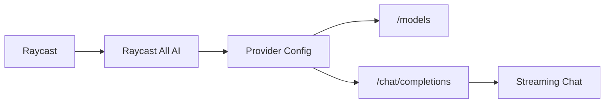

<p align="center">
  
</p>

# Raycast All AI

> One Raycast extension for many OpenAI-compatible AI providers.  
> 一个 Raycast 扩展，接入各种 OpenAI-compatible AI 服务。

Raycast All AI lets you chat with custom AI gateways and popular providers from Raycast, using your own Base URL, API key, auth header, and model name.

Raycast All AI 可以让你在 Raycast 里接入自定义 AI 网关和常见模型服务，支持自由填写 Base URL、API Key、鉴权方式和模型名。

## ✨ Features / 功能

| English | 中文 |
| --- | --- |
| 🔌 Custom OpenAI-compatible API provider | 🔌 自定义 OpenAI-compatible API 接入 |
| 🔑 Configurable API key and auth header style | 🔑 可配置 API Key 和鉴权 Header |
| 🧠 Auto-fetch models from `/models` | 🧠 自动从 `/models` 拉取可用模型 |
| ✅ Test connection before saving | ✅ 保存前可一键测试连接 |
| 💬 Streaming chat inside Raycast | 💬 Raycast 内流式聊天 |
| 🗂️ Local conversation history | 🗂️ 本地保存会话历史 |

## 🤖 Supported Providers / 支持的接入方式

- 🌐 Custom OpenAI-compatible API
- ✨ Xiaomi MiMo Pay-as-you-go API
- 🪙 Xiaomi MiMo Token Plan
- ⚡ DeepSeek API

Custom providers work best when they expose OpenAI-compatible endpoints:

自定义 Provider 最适合接入兼容 OpenAI 协议的服务：

```text
GET  /models
POST /chat/completions
```

## 🧭 How It Works / 工作流程



## 🚀 Quick Start / 快速开始

```bash
npm install
npm run dev
```

Then open Raycast and run:

然后在 Raycast 里运行：

```text
Configure Provider
```

1. Choose a provider.  
   选择一个 Provider。
2. Enter your Base URL and API key.  
   输入 Base URL 和 API Key。
3. Pick an auth mode.  
   选择鉴权方式。
4. Refresh models or type a model manually.  
   刷新模型列表，或手动填写模型名。
5. Use **Test Connection** to verify the setup.  
   使用 **Test Connection** 测试接入是否成功。
6. Open **Chat** and start talking.  
   打开 **Chat** 开始聊天。

## ⚙️ Custom Provider / 自定义 Provider

For `Custom OpenAI-compatible API`, enter a base URL such as:

对于 `Custom OpenAI-compatible API`，可以填写类似这样的 Base URL：

```text
https://api.example.com/v1
```

Supported auth modes:

支持的鉴权方式：

- `Authorization: Bearer <key>`
- `api-key: <key>`
- `x-api-key: <key>`
- `No Auth Header`

If your provider does not expose `/models`, you can still type the model ID manually in **Custom Model**.

如果服务商没有提供 `/models`，也可以直接在 **Custom Model** 里手动填写模型 ID。

## 🧪 Test Connection / 测试连接

Use **Test Connection** in the configuration screen before saving. It sends a tiny `/chat/completions` request with the current form values.

保存配置前可以点击 **Test Connection**。它会用当前表单里的配置发起一次很小的 `/chat/completions` 请求。

If it fails, the toast usually shows the provider's error message, which helps identify whether the issue is the URL, key, auth mode, or model name.

如果测试失败，提示里通常会显示服务商返回的错误信息，方便判断是 URL、Key、鉴权方式还是模型名出了问题。

## 🛠️ Development / 开发

```bash
npm run build
npm run lint
```

## 📝 Notes / 说明

- This extension does not replace Raycast's built-in AI model picker. It provides its own Raycast-native chat command.  
  这个扩展不会替换 Raycast 原生 AI 的模型选择器，而是提供独立的 Raycast 聊天命令。
- Non-OpenAI-compatible APIs may need dedicated provider adapters.  
  如果某家 API 不兼容 OpenAI 协议，可能需要单独写 Provider 适配。
- API keys are stored with Raycast LocalStorage on your machine.  
  API Key 会通过 Raycast LocalStorage 保存在本机。
